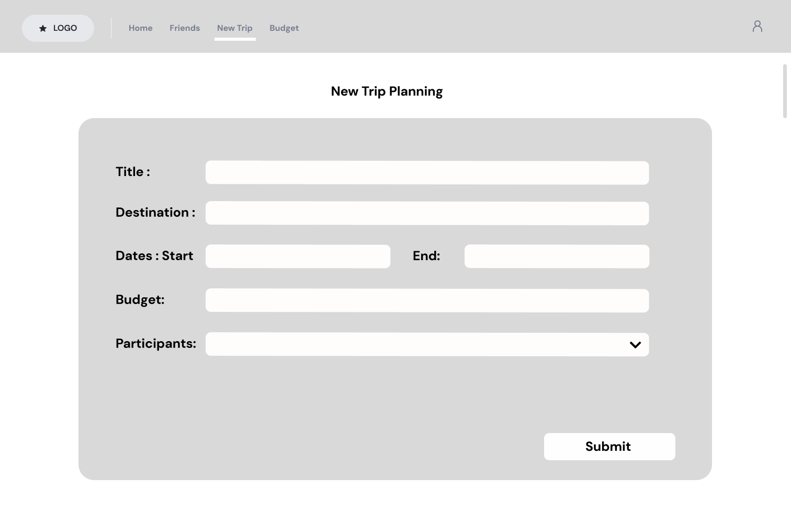
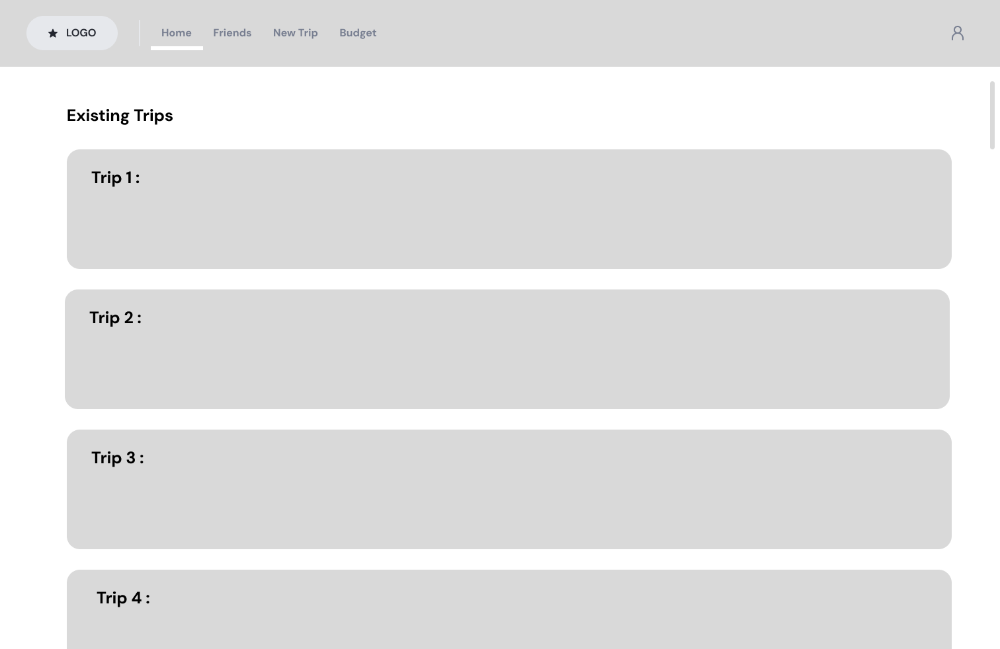
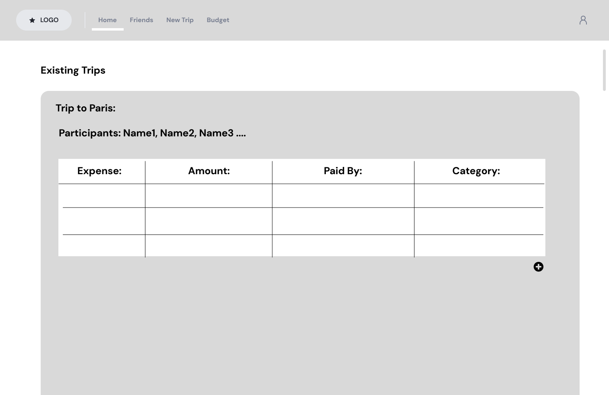
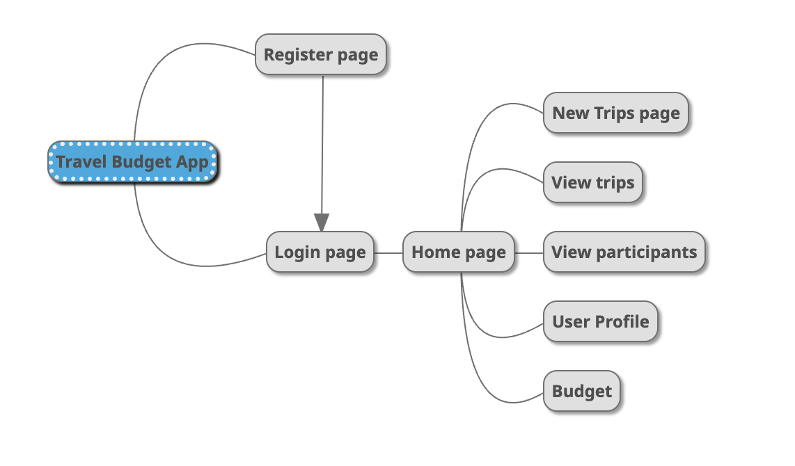

# **TripTally: Travel Budgeting Tool**

## **Overview**

Traveling alone or in a group often involve a lot of expenses, making budgeting and expense tracking challenging. The **Travel Budgeting Tool** simplifies trip planning by allowing users to estimate and log expenses. This app enables users to view total trip budgets, track individual contributions, and calculate how much each person owes or is owed. Users can manage multiple trips and view the budget and expenses per trip, making it ideal for group travel planning.

## **Data Model**

The application will store `Users`, `Trips`, and `Expenses`:

- **Users** can have multiple trips (via references).
- Each **Trip** can have multiple expenses (by embedding).
- Each **Expense** is associated with a `Trip` and one or more `Users`.

### **Sample Documents**

#### **User**

```javascript
{
  username: "johndoe",
  hash: // a password hash,
  trips: // an array of references to Trip documents
}
```

#### **Trip**

```javascript
{
  title: "Trip to Paris",
  destination: "Paris",
  dates: { start: "2024-06-01", end: "2024-06-07" },
  estimatedBudget: 1200,
  participants: [ // array of User references ],
  expenses: [ // array of Expense objects ],
  createdAt: // timestamp
}
```

#### **Expense**

```javascript
{
  trip: // a reference to a Trip object,
  description: "Dinner at Eiffel Tower",
  amount: 150,
  payer: // a reference to the User who paid,
  splitAmong: [ // array of User references who share the cost ],
  createdAt: // timestamp
}
```

## **[First Draft Schema](db.mjs)**

A draft schema has been created in `db.mjs` to structure the application’s data model.

## **Wireframes**

Below are wireframes for key pages in the application:

1. **/create** - Page to create a new trip with details like title, destination, dates, and estimated budget.

   

2. **/home** - Page for showing all trips a user has created or joined.

   

3. **/trip/slug** - Page for showing a specific trip's details, expenses, and individual balances.

   

## **Site Map**

Here’s a simple site map:

   

## **User Stories**

1. As a non-registered user, I can register an account on the site.
2. As a user, I can log in to access my trips and expenses.
3. As a user, I can create a new trip with details like title, destination, and budget.
4. As a user, I can add participants to a trip.
5. As a user, I can log an expense, specifying the amount, description, payer, and splitting details.
6. As a user, I can view my balance and see how much others paid in the trip.
7. As a user, I can view a summary of expenses and budget for each trip.

## **Research Topics**

- **(6 points) Front-End Framework - React.js**
  - Using React.js to build a responsive and dynamic front-end for the application.
  - Allows for a more interactive user experience and facilitates component-based architecture.
  - **Possible Solutions:**
    - React Router for navigation.
    - Redux or Context API for state management.

- **(3 points) Unit Testing - Mocha**
  - Setting up unit tests for critical parts of the application using Mocha.
  - Ensures the app functions as expected with minimal bugs; includes at least 4 test cases.
  - **Possible Solutions:**
    - Chai for assertions.


- **(2 points) CSS Framework - Bootstrap**
  - Using Bootstrap to style the front-end, with some customizations for a unique theme.
  - Provides a responsive, mobile-first layout with pre-designed components, saving development time.
  - **Possible Solutions:**
    - Custom Bootstrap Theme for unique styling.
    - Bootstrap Icons for enhanced UI.

**Total**: 11 points (meeting the requirement of a minimum of 10 points).

## **[Main Project File](app.mjs)**

A skeleton Express application has been created in `app.mjs`, with initial routing setup, dependencies in `package.json`, and a `.gitignore` file for Node.js.

## Annotations / References Used

1. [React documentation](https://reactjs.org/docs/getting-started.html) - to understand component-based architecture and building the front-end.
2. [Mocha testing documentation](https://mochajs.org/#getting-started) - for setting up and running unit tests.
3. [Bootstrap documentation](https://getbootstrap.com/docs/5.0/getting-started/introduction/) - for integrating Bootstrap with custom styling.
4. [Mongoose documentation](https://mongoosejs.com/docs/guide.html) - for setting up and linking schemas.


